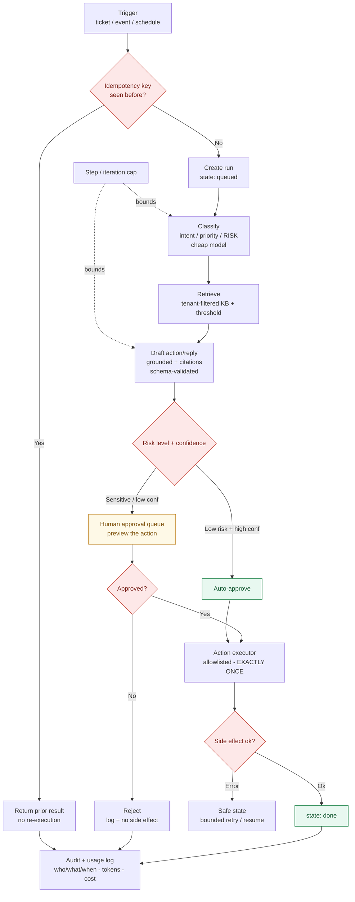

# AI Workflow Builder

Flow for an AI automation run: **trigger → classify → retrieve → draft → risk gate → act**, with a mandatory human-approval branch for sensitive actions and idempotent, exactly-once side effects. Renders on GitHub via Mermaid.

See [`../examples/ai-workflow-automation-architecture.md`](../examples/ai-workflow-automation-architecture.md) and [`../docs/02-llm-app-security-checklist.md`](../docs/02-llm-app-security-checklist.md).

## What the diagram encodes

- **Idempotency at the entry** — a repeated trigger returns the prior result, never re-runs side effects.
- **Risk classification drives the approval gate** — sensitive/low-confidence actions cannot auto-execute.
- **Human approval previews the exact action** before it fires; rejection produces no side effect.
- **The executor is allowlisted and exactly-once**, so retries can't double-send.
- **A step/iteration cap bounds the run**, preventing runaway loops and cost.
- **Everything ends in an audit + usage log** — auto, approved, rejected, or cached.
