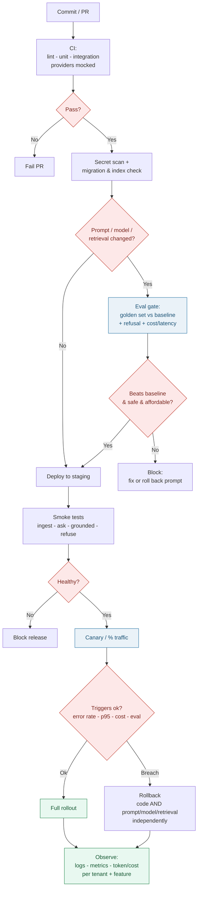

# Deployment Flow

CI/CD flow for AI changes with an **evaluation gate**, staged rollout, and explicit rollback triggers. The key idea: a prompt/model/retrieval change must pass eval before it can reach production, and it must be reversible **independently of code**. Renders on GitHub via Mermaid.

See [`../docs/06-deployment-readiness-checklist.md`](../docs/06-deployment-readiness-checklist.md) and [`../docs/05-ai-evaluation-checklist.md`](../docs/05-ai-evaluation-checklist.md).

## What the diagram encodes

- **The eval gate only triggers for AI changes** — code-only changes skip it, but prompt/model/retrieval changes cannot bypass it.
- **The gate checks three things:** beats baseline (quality), stays safe (refusal/guardrails), stays affordable (cost/latency).
- **Smoke tests run against a real environment** before any user traffic.
- **Canary precedes full rollout**, with explicit rollback triggers (error rate, p95 latency, cost, eval drop).
- **Rollback covers code *and* prompt/model/retrieval independently** — config-level revert, not only redeploy.
- **Observability is the endpoint of every path**, including rollback.
