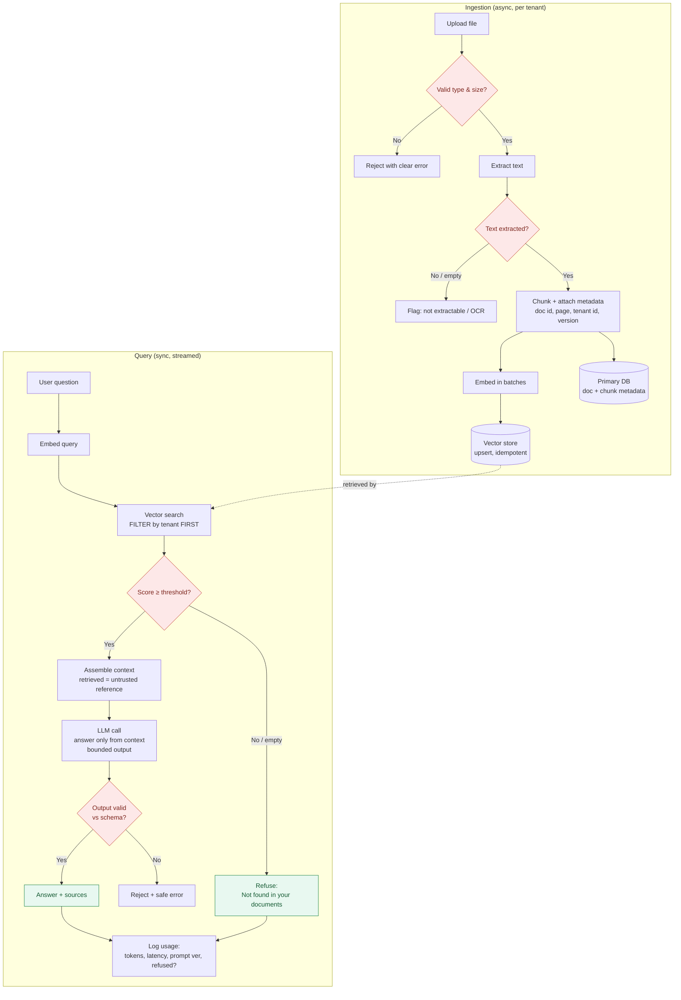

# RAG Pipeline

End-to-end flow for a tenant-isolated RAG system: ingestion on the left, query/answer on the right, with the **weak-context refusal** path made explicit. Renders on GitHub via Mermaid.

See [`../docs/01-rag-architecture-checklist.md`](../docs/01-rag-architecture-checklist.md) and [`../examples/rag-chatbot-architecture.md`](../examples/rag-chatbot-architecture.md).

## What the diagram encodes

- **Tenant filter happens before ranking**, in the data layer — not in the prompt.
- **Two decision gates protect quality:** the score threshold (→ refuse) and schema validation (→ safe error).
- **Refusal is a first-class path**, not an error — and it's logged like any answer.
- **Ingestion is idempotent** (upsert), so re-uploads don't duplicate chunks.
- **Retrieved content is treated as untrusted reference**, mitigating prompt injection via documents.
